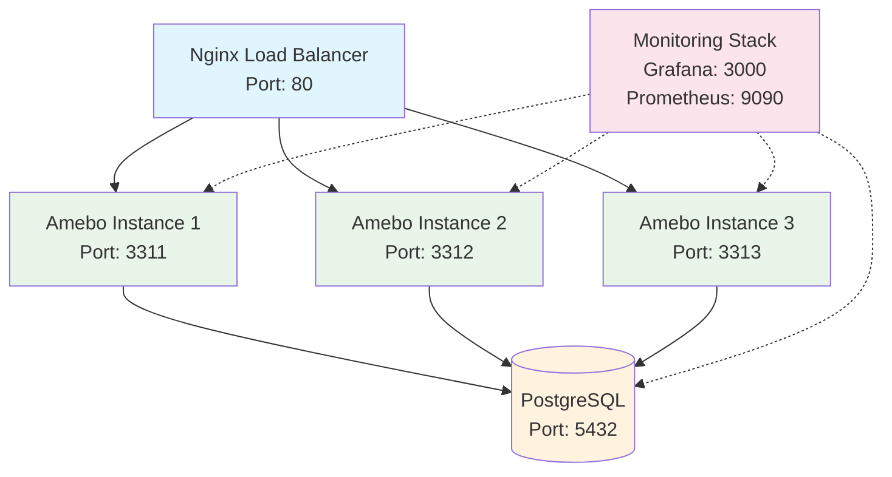

# Docker Cluster Deployment

Deploy Amebo as a high-availability cluster with 3 instances, shared PostgreSQL database, and Nginx load balancer for production resilience.

## Architecture Overview



## Features

=== "🚀 High Availability"

    - **3 Application Instances** with automatic failover
    - **Load Balancing** with health checks
    - **Shared Database** for consistency
    - **Auto-restart** on failure

=== "⚖️ Load Balancing"

    - **Least Connections** algorithm
    - **Health Check** endpoints
    - **Automatic Failover** (30s timeout)
    - **Retry Logic** (3 attempts)

=== "🔍 Monitoring"

    - **Prometheus** metrics collection
    - **Grafana** dashboards
    - **cAdvisor** container metrics
    - **Health Check** scripts

=== "🛡️ Security"

    - **Isolated Network** for services
    - **Non-root** containers
    - **Secret Management** via environment
    - **Firewall Ready** configuration

## Quick Start

### Prerequisites

- **Docker** 20.10+
- **Docker Compose** 2.0+
- **4GB+ RAM** available
- **Ports** 80, 3311-3313, 5432 available

### 1. Clone and Start

```bash
# Clone repository
git clone https://github.com/rayattack/amebo.git
cd amebo

# Make scripts executable
chmod +x *.sh

# Start the cluster
./start-cluster.sh
```

### 2. Verify Deployment

```bash
# Check cluster health
./health-check.sh

# Test load balancer
curl http://localhost/v1/applications

# Test individual instances
curl http://localhost:3311/v1/applications
curl http://localhost:3312/v1/applications
curl http://localhost:3313/v1/applications
```

### 3. Access Services

| Service | URL | Credentials |
|---------|-----|-------------|
| **Load Balancer** | http://localhost | - |
| **Amebo Web UI** | http://localhost | admin / N0.open.Sesame! |
| **PostgreSQL** | localhost:5432 | amebo / eldorad0 |
| **Grafana** | http://localhost:3000 | admin / admin |
| **Prometheus** | http://localhost:9090 | - |

## Configuration

### Environment Variables

Copy and customize the environment file:

```bash
# Copy example configuration
cp .env.example .env

# Edit configuration
nano .env
```

Key settings:

```bash
# Database
POSTGRES_DB=amebo
POSTGRES_USER=amebo
POSTGRES_PASSWORD=eldorad0

# Application
AMEBO_SECRET=9ad35404a28e59759bdd484bb81c0755
AMEBO_USERNAME=administrator
AMEBO_PASSWORD=N0.open.Sesame!

# Performance
AMEBO_ENVELOPE=256
AMEBO_IDLES=5
AMEBO_REST_WHEN=0
```

### Production Configuration

For production, use the production environment:

```bash
# Copy production template
cp .env.production .env

# Update with secure values
nano .env
```

!!! warning "Security Checklist"
    
    - [ ] Change default passwords
    - [ ] Use strong secrets (32+ characters)
    - [ ] Configure SSL certificates
    - [ ] Set up firewall rules
    - [ ] Enable log rotation

## Scaling

### Horizontal Scaling

Add more Amebo instances:

```bash
# Scale existing services
docker-compose up -d --scale amebo-1=2 --scale amebo-2=2

# Or add new services in docker-compose.yml
```

### Vertical Scaling

Adjust resource limits:

```yaml
services:
  amebo-1:
    deploy:
      resources:
        limits:
          cpus: '2.0'
          memory: 2G
        reservations:
          cpus: '0.5'
          memory: 512M
```

## Monitoring

### Start Monitoring Stack

```bash
# Start monitoring services
docker-compose -f docker-compose.monitoring.yml up -d

# Access Grafana
open http://localhost:3000
```

### Key Metrics

Monitor these important metrics:

- **Response Time**: < 10ms average
- **Error Rate**: < 1%
- **CPU Usage**: < 80%
- **Memory Usage**: < 80%
- **Database Connections**: Monitor pool usage

### Alerts

Set up alerts for:

- Service downtime
- High error rates
- Resource exhaustion
- Database connectivity issues

## Backup & Recovery

### Database Backup

```bash
# Create backup
docker exec amebo-postgres pg_dump -U amebo amebo > backup-$(date +%Y%m%d).sql

# Automated backup script
cat > backup.sh << 'EOF'
#!/bin/bash
BACKUP_DIR="/opt/amebo/backups"
mkdir -p $BACKUP_DIR
docker exec amebo-postgres pg_dump -U amebo amebo > $BACKUP_DIR/amebo-$(date +%Y%m%d-%H%M%S).sql
find $BACKUP_DIR -name "*.sql" -mtime +7 -delete
EOF

chmod +x backup.sh

# Add to crontab for daily backups
echo "0 2 * * * /path/to/backup.sh" | crontab -
```

### Volume Backup

```bash
# Backup PostgreSQL data volume
docker run --rm \
  -v amebo_postgres_data:/data \
  -v $(pwd):/backup \
  alpine tar czf /backup/postgres-data-$(date +%Y%m%d).tar.gz -C /data .
```

### Restore Procedures

```bash
# Restore database from backup
docker exec -i amebo-postgres psql -U amebo amebo < backup-20241210.sql

# Restore volume
docker run --rm \
  -v amebo_postgres_data:/data \
  -v $(pwd):/backup \
  alpine tar xzf /backup/postgres-data-20241210.tar.gz -C /data
```

## Troubleshooting

### Common Issues

=== "Service Won't Start"

    ```bash
    # Check logs
    docker-compose logs amebo-1
    
    # Check port conflicts
    netstat -tulpn | grep :3310
    
    # Restart specific service
    docker-compose restart amebo-1
    ```

=== "Database Connection Issues"

    ```bash
    # Check PostgreSQL logs
    docker logs amebo-postgres
    
    # Test connection
    docker exec -it amebo-postgres psql -U amebo -d amebo
    
    # Check network connectivity
    docker exec amebo-instance-1 ping postgres
    ```

=== "Load Balancer Issues"

    ```bash
    # Check Nginx logs
    docker logs amebo-loadbalancer
    
    # Test backend connectivity
    docker exec amebo-loadbalancer wget -qO- http://amebo-1:3310/v1/applications
    
    # Reload Nginx config
    docker exec amebo-loadbalancer nginx -s reload
    ```

=== "Performance Issues"

    ```bash
    # Check resource usage
    docker stats
    
    # Monitor database performance
    docker exec -it amebo-postgres psql -U amebo -d amebo -c "
      SELECT query, calls, total_time, mean_time 
      FROM pg_stat_statements 
      ORDER BY total_time DESC LIMIT 10;"
    
    # Adjust configuration
    nano .env  # Increase AMEBO_ENVELOPE, decrease AMEBO_IDLES
    docker-compose restart
    ```

### Health Checks

```bash
# Comprehensive health check
./health-check.sh

# Manual checks
curl -f http://localhost/health
curl -f http://localhost:3311/v1/applications
curl -f http://localhost:3312/v1/applications
curl -f http://localhost:3313/v1/applications

# Database health
docker exec amebo-postgres pg_isready -U amebo -d amebo
```

### Log Management

```bash
# View all logs
docker-compose logs -f

# View specific service
docker-compose logs -f amebo-1

# Limit log output
docker-compose logs --tail=100 -f

# Export logs
docker-compose logs > cluster-logs-$(date +%Y%m%d).log
```

## Maintenance

### Updates

```bash
# Pull latest images
docker-compose pull

# Restart with new images
docker-compose up -d

# Clean up old images
docker image prune -f
```

### Cleanup

```bash
# Stop cluster
./stop-cluster.sh

# Remove everything including volumes (WARNING: Data loss!)
./stop-cluster.sh --remove-volumes

# Clean up Docker system
docker system prune -f
```

## Security Hardening

### Network Security

```yaml
# Custom network configuration
networks:
  amebo-network:
    driver: bridge
    ipam:
      config:
        - subnet: 172.20.0.0/16
```

### Container Security

```yaml
services:
  amebo-1:
    security_opt:
      - no-new-privileges:true
    read_only: true
    tmpfs:
      - /tmp
    user: "1000:1000"
```

### Secrets Management

```yaml
services:
  amebo-1:
    environment:
      AMEBO_SECRET_FILE: /run/secrets/amebo_secret
    secrets:
      - amebo_secret

secrets:
  amebo_secret:
    file: ./secrets/amebo_secret.txt
```

## Performance Tuning

### Database Optimization

```sql
-- PostgreSQL performance settings
ALTER SYSTEM SET shared_buffers = '256MB';
ALTER SYSTEM SET effective_cache_size = '1GB';
ALTER SYSTEM SET maintenance_work_mem = '64MB';
ALTER SYSTEM SET checkpoint_completion_target = 0.9;
ALTER SYSTEM SET wal_buffers = '16MB';
SELECT pg_reload_conf();
```

### Application Tuning

```bash
# Increase batch processing
AMEBO_ENVELOPE=512

# Reduce idle time
AMEBO_IDLES=3

# Adjust rest threshold
AMEBO_REST_WHEN=10
```

## Next Steps

- **[Production Deployment](production.md)** - Production best practices
- **[Monitoring Setup](monitoring.md)** - Advanced monitoring configuration
- **[API Reference](../api/overview.md)** - Complete API documentation
- **[Performance Guide](../support/performance.md)** - Performance optimization
