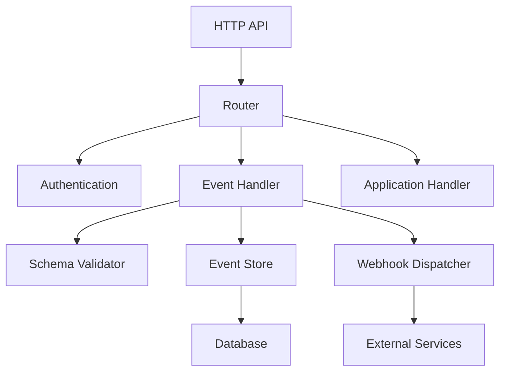

# Amebo Architecture

Understanding Amebo's internal architecture and design decisions.

## High-Level Architecture

## Core Components

### HTTP Server
- FastAPI-based REST API
- JWT authentication
- Request validation
- Error handling

### Event Processing
- Schema validation using JSON Schema
- Asynchronous event publishing
- Batch processing for performance
- Retry logic for failed deliveries

### Database Layer
- PostgreSQL for production
- SQLite for development
- Connection pooling
- Migration support

### Webhook Delivery
- Asynchronous delivery
- Exponential backoff retry
- Signature verification
- Dead letter queue

## Design Principles

1. **Simplicity**: Only 4 core concepts
2. **Performance**: Sub-10ms response times
3. **Reliability**: ACID transactions and retries
4. **Scalability**: Horizontal scaling support

## Next Steps
- [Contributing Guide](contributing.md)
- [Testing Guide](testing.md)
