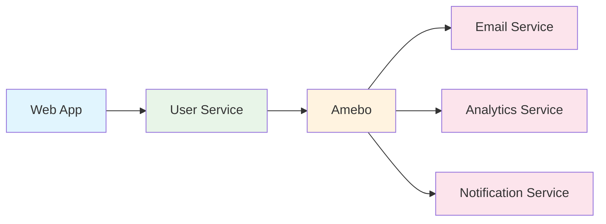

# Basic Usage Examples

This guide provides practical examples of using Amebo for common event-driven scenarios. Each example includes complete code samples and explanations.

## Example 1: User Registration Flow

A typical user registration flow where multiple services need to be notified when a new user is created.

### Architecture



### Step 1: Register Applications

=== "User Service"

    ```bash
    curl -X POST http://localhost/v1/applications \
      -H "Content-Type: application/json" \
      -d '{
        "application": "user-service",
        "address": "https://users.myapp.com",
        "secret": "user-service-webhook-secret"
      }'
    ```

=== "Email Service"

    ```bash
    curl -X POST http://localhost/v1/applications \
      -H "Content-Type: application/json" \
      -d '{
        "application": "email-service",
        "address": "https://email.myapp.com",
        "secret": "email-service-webhook-secret"
      }'
    ```

=== "Analytics Service"

    ```bash
    curl -X POST http://localhost/v1/applications \
      -H "Content-Type: application/json" \
      -d '{
        "application": "analytics-service",
        "address": "https://analytics.myapp.com",
        "secret": "analytics-service-webhook-secret"
      }'
    ```

### Step 2: Define User Events

```bash
curl -X POST http://localhost/v1/actions \
  -H "Content-Type: application/json" \
  -d '{
    "action": "user.created",
    "application": "user-service",
    "schemata": {
      "type": "object",
      "properties": {
        "id": {"type": "string"},
        "email": {"type": "string", "format": "email"},
        "name": {"type": "string"},
        "created_at": {"type": "string", "format": "date-time"},
        "source": {"type": "string", "enum": ["web", "mobile", "api"]},
        "metadata": {
          "type": "object",
          "properties": {
            "ip_address": {"type": "string"},
            "user_agent": {"type": "string"},
            "referrer": {"type": "string"}
          }
        }
      },
      "required": ["id", "email", "name", "created_at", "source"],
      "additionalProperties": false
    }
  }'
```

### Step 3: Set Up Subscriptions

=== "Email Service Subscription"

    ```bash
    curl -X POST http://localhost/v1/subscriptions \
      -H "Content-Type: application/json" \
      -d '{
        "application": "email-service",
        "subscription": "welcome-email",
        "action": "user.created",
        "handler": "https://email.myapp.com/webhooks/user-created",
        "max_retries": 3
      }'
    ```

=== "Analytics Service Subscription"

    ```bash
    curl -X POST http://localhost/v1/subscriptions \
      -H "Content-Type: application/json" \
      -d '{
        "application": "analytics-service",
        "subscription": "user-tracking",
        "action": "user.created",
        "handler": "https://analytics.myapp.com/webhooks/user-created",
        "max_retries": 5
      }'
    ```

### Step 4: Publish User Created Event

When a user registers, the user service publishes an event:

```bash
curl -X POST http://localhost/v1/events \
  -H "Content-Type: application/json" \
  -d '{
    "action": "user.created",
    "payload": {
      "id": "user-12345",
      "email": "john.doe@example.com",
      "name": "John Doe",
      "created_at": "2024-12-10T10:30:00Z",
      "source": "web",
      "metadata": {
        "ip_address": "192.168.1.100",
        "user_agent": "Mozilla/5.0...",
        "referrer": "https://google.com"
      }
    }
  }'
```

### Step 5: Handle Webhooks

=== "Email Service Handler (Python)"

    ```python
    from flask import Flask, request, jsonify
    import hmac
    import hashlib
    import json
    
    app = Flask(__name__)
    WEBHOOK_SECRET = "email-service-webhook-secret"
    
    def verify_signature(payload, signature):
        expected = hmac.new(
            WEBHOOK_SECRET.encode(),
            payload.encode(),
            hashlib.sha256
        ).hexdigest()
        return hmac.compare_digest(f"sha256={expected}", signature)
    
    @app.route('/webhooks/user-created', methods=['POST'])
    def handle_user_created():
        # Verify webhook signature
        signature = request.headers.get('X-Amebo-Signature')
        if not verify_signature(request.data.decode(), signature):
            return jsonify({'error': 'Invalid signature'}), 401
        
        # Parse event data
        event = request.json
        user_data = event['payload']
        
        # Send welcome email
        send_welcome_email(
            email=user_data['email'],
            name=user_data['name'],
            user_id=user_data['id']
        )
        
        return jsonify({'status': 'success'}), 200
    
    def send_welcome_email(email, name, user_id):
        # Email sending logic here
        print(f"Sending welcome email to {email} for user {user_id}")
        # Integration with email provider (SendGrid, Mailgun, etc.)
    ```

=== "Analytics Service Handler (Node.js)"

    ```javascript
    const express = require('express');
    const crypto = require('crypto');
    const app = express();
    
    const WEBHOOK_SECRET = 'analytics-service-webhook-secret';
    
    app.use(express.json());
    
    function verifySignature(payload, signature) {
      const expected = crypto
        .createHmac('sha256', WEBHOOK_SECRET)
        .update(payload)
        .digest('hex');
      
      return crypto.timingSafeEqual(
        Buffer.from(`sha256=${expected}`),
        Buffer.from(signature)
      );
    }
    
    app.post('/webhooks/user-created', (req, res) => {
      // Verify webhook signature
      const signature = req.headers['x-amebo-signature'];
      if (!verifySignature(JSON.stringify(req.body), signature)) {
        return res.status(401).json({ error: 'Invalid signature' });
      }
      
      // Process event
      const { payload } = req.body;
      
      // Track user registration
      trackUserRegistration({
        userId: payload.id,
        email: payload.email,
        source: payload.source,
        timestamp: payload.created_at,
        metadata: payload.metadata
      });
      
      res.json({ status: 'success' });
    });
    
    function trackUserRegistration(userData) {
      // Analytics tracking logic
      console.log('Tracking user registration:', userData);
      // Integration with analytics platform (Google Analytics, Mixpanel, etc.)
    }
    
    app.listen(3000, () => {
      console.log('Analytics webhook server running on port 3000');
    });
    ```

## Example 2: E-commerce Order Processing

A more complex example showing order processing with multiple state changes.

### Order Lifecycle Events

```bash
# Define order events
curl -X POST http://localhost/v1/actions \
  -H "Content-Type: application/json" \
  -d '{
    "action": "order.placed",
    "application": "order-service",
    "schemata": {
      "type": "object",
      "properties": {
        "order_id": {"type": "string"},
        "customer_id": {"type": "string"},
        "items": {
          "type": "array",
          "items": {
            "type": "object",
            "properties": {
              "product_id": {"type": "string"},
              "quantity": {"type": "integer", "minimum": 1},
              "price": {"type": "number", "minimum": 0}
            },
            "required": ["product_id", "quantity", "price"]
          }
        },
        "total_amount": {"type": "number", "minimum": 0},
        "currency": {"type": "string", "pattern": "^[A-Z]{3}$"},
        "shipping_address": {"type": "object"},
        "payment_method": {"type": "string"}
      },
      "required": ["order_id", "customer_id", "items", "total_amount", "currency"]
    }
  }'

curl -X POST http://localhost/v1/actions \
  -H "Content-Type: application/json" \
  -d '{
    "action": "order.payment_processed",
    "application": "payment-service",
    "schemata": {
      "type": "object",
      "properties": {
        "order_id": {"type": "string"},
        "payment_id": {"type": "string"},
        "amount": {"type": "number"},
        "currency": {"type": "string"},
        "status": {"type": "string", "enum": ["success", "failed"]},
        "transaction_id": {"type": "string"}
      },
      "required": ["order_id", "payment_id", "amount", "currency", "status"]
    }
  }'

curl -X POST http://localhost/v1/actions \
  -H "Content-Type: application/json" \
  -d '{
    "action": "order.shipped",
    "application": "fulfillment-service",
    "schemata": {
      "type": "object",
      "properties": {
        "order_id": {"type": "string"},
        "tracking_number": {"type": "string"},
        "carrier": {"type": "string"},
        "estimated_delivery": {"type": "string", "format": "date"},
        "shipping_address": {"type": "object"}
      },
      "required": ["order_id", "tracking_number", "carrier"]
    }
  }'
```

### Event Flow

=== "1. Order Placed"

    ```bash
    curl -X POST http://localhost/v1/events \
      -H "Content-Type: application/json" \
      -d '{
        "action": "order.placed",
        "payload": {
          "order_id": "order-789",
          "customer_id": "customer-123",
          "items": [
            {
              "product_id": "prod-456",
              "quantity": 2,
              "price": 29.99
            },
            {
              "product_id": "prod-789",
              "quantity": 1,
              "price": 49.99
            }
          ],
          "total_amount": 109.97,
          "currency": "USD",
          "shipping_address": {
            "street": "123 Main St",
            "city": "Anytown",
            "state": "CA",
            "zip": "12345"
          },
          "payment_method": "credit_card"
        }
      }'
    ```

=== "2. Payment Processed"

    ```bash
    curl -X POST http://localhost/v1/events \
      -H "Content-Type: application/json" \
      -d '{
        "action": "order.payment_processed",
        "payload": {
          "order_id": "order-789",
          "payment_id": "pay-456",
          "amount": 109.97,
          "currency": "USD",
          "status": "success",
          "transaction_id": "txn-123456"
        }
      }'
    ```

=== "3. Order Shipped"

    ```bash
    curl -X POST http://localhost/v1/events \
      -H "Content-Type: application/json" \
      -d '{
        "action": "order.shipped",
        "payload": {
          "order_id": "order-789",
          "tracking_number": "1Z999AA1234567890",
          "carrier": "UPS",
          "estimated_delivery": "2024-12-15",
          "shipping_address": {
            "street": "123 Main St",
            "city": "Anytown",
            "state": "CA",
            "zip": "12345"
          }
        }
      }'
    ```

## Example 3: Real-time Notifications

Setting up real-time notifications using WebSockets and Amebo events.

### WebSocket Notification Service

=== "Server (Node.js + Socket.io)"

    ```javascript
    const express = require('express');
    const http = require('http');
    const socketIo = require('socket.io');
    const crypto = require('crypto');
    
    const app = express();
    const server = http.createServer(app);
    const io = socketIo(server);
    
    app.use(express.json());
    
    // Store user socket connections
    const userSockets = new Map();
    
    // Handle WebSocket connections
    io.on('connection', (socket) => {
      socket.on('authenticate', (data) => {
        const { userId, token } = data;
        // Verify JWT token here
        if (verifyToken(token)) {
          userSockets.set(userId, socket);
          socket.userId = userId;
          socket.emit('authenticated');
        }
      });
      
      socket.on('disconnect', () => {
        if (socket.userId) {
          userSockets.delete(socket.userId);
        }
      });
    });
    
    // Webhook handler for Amebo events
    app.post('/webhooks/user-notification', (req, res) => {
      const { payload } = req.body;
      const { user_id, message, type } = payload;
      
      // Send notification to user if connected
      const userSocket = userSockets.get(user_id);
      if (userSocket) {
        userSocket.emit('notification', {
          type,
          message,
          timestamp: new Date().toISOString()
        });
      }
      
      res.json({ status: 'delivered' });
    });
    
    server.listen(3000);
    ```

=== "Client (JavaScript)"

    ```javascript
    const socket = io('http://localhost:3000');
    
    // Authenticate with JWT token
    socket.emit('authenticate', {
      userId: 'user-123',
      token: 'your-jwt-token'
    });
    
    // Listen for notifications
    socket.on('notification', (notification) => {
      showNotification(notification);
    });
    
    function showNotification(notification) {
      // Display notification in UI
      const notificationElement = document.createElement('div');
      notificationElement.className = `notification ${notification.type}`;
      notificationElement.textContent = notification.message;
      
      document.getElementById('notifications').appendChild(notificationElement);
      
      // Auto-remove after 5 seconds
      setTimeout(() => {
        notificationElement.remove();
      }, 5000);
    }
    ```

## Testing Your Setup

### Verification Script

```bash
#!/bin/bash

echo "Testing Amebo setup..."

# Test 1: List applications
echo "1. Testing applications endpoint..."
curl -s http://localhost/v1/applications | jq .

# Test 2: List actions
echo "2. Testing actions endpoint..."
curl -s http://localhost/v1/actions | jq .

# Test 3: List subscriptions
echo "3. Testing subscriptions endpoint..."
curl -s http://localhost/v1/subscriptions | jq .

# Test 4: Publish test event
echo "4. Publishing test event..."
curl -X POST http://localhost/v1/events \
  -H "Content-Type: application/json" \
  -d '{
    "action": "user.created",
    "payload": {
      "id": "test-user",
      "email": "test@example.com",
      "name": "Test User",
      "created_at": "2024-12-10T10:30:00Z",
      "source": "test"
    }
  }' | jq .

# Test 5: Check events
echo "5. Checking events..."
curl -s http://localhost/v1/events | jq .

echo "Testing complete!"
```

## Common Patterns

### 1. Idempotent Event Processing

```python
def handle_webhook(event):
    event_id = event.get('event_id')
    
    # Check if already processed
    if is_event_processed(event_id):
        return {'status': 'already_processed'}
    
    # Process event
    result = process_event(event)
    
    # Mark as processed
    mark_event_processed(event_id)
    
    return result
```

### 2. Event Replay

```bash
# Get events for replay
curl "http://localhost/v1/events?from=2024-12-01&to=2024-12-10&action=user.created"

# Replay specific event
curl -X POST http://localhost/v1/regists/event-123
```

### 3. Dead Letter Queue Handling

```python
def handle_failed_webhook(event, error):
    if event['delivery_attempt'] >= MAX_RETRIES:
        # Send to dead letter queue
        send_to_dlq(event, error)
        
        # Alert operations team
        alert_ops_team(f"Event {event['event_id']} failed after {MAX_RETRIES} attempts")
```

## Next Steps

- **[Microservices Example](microservices.md)** - Complete microservices architecture
- **[Event Sourcing](event-sourcing.md)** - Event sourcing patterns with Amebo
- **[Integration Patterns](integration-patterns.md)** - Common integration scenarios
- **[API Reference](../api/overview.md)** - Complete API documentation
