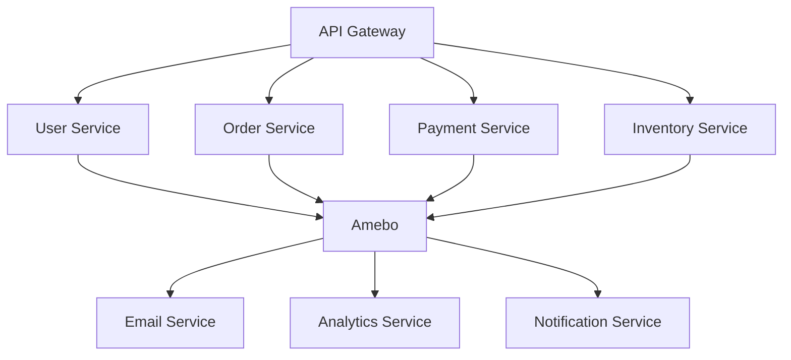

# Microservices Example

Complete example of using Amebo for microservices communication in an e-commerce platform.

## Architecture



## Services Setup

### User Service Events

```bash
# Register user service
curl -X POST http://localhost/v1/applications \
  -d '{
    "application": "user-service",
    "address": "https://users.myapp.com",
    "secret": "user-service-secret"
  }'

# Define user events
curl -X POST http://localhost/v1/actions \
  -d '{
    "action": "user.created",
    "application": "user-service",
    "schemata": {
      "type": "object",
      "properties": {
        "user_id": {"type": "string"},
        "email": {"type": "string", "format": "email"},
        "name": {"type": "string"},
        "plan": {"type": "string", "enum": ["free", "premium"]}
      },
      "required": ["user_id", "email", "name"]
    }
  }'
```

### Order Service Events

```bash
# Register order service
curl -X POST http://localhost/v1/applications \
  -d '{
    "application": "order-service",
    "address": "https://orders.myapp.com",
    "secret": "order-service-secret"
  }'

# Define order events
curl -X POST http://localhost/v1/actions \
  -d '{
    "action": "order.placed",
    "application": "order-service",
    "schemata": {
      "type": "object",
      "properties": {
        "order_id": {"type": "string"},
        "user_id": {"type": "string"},
        "items": {"type": "array"},
        "total": {"type": "number"},
        "currency": {"type": "string"}
      },
      "required": ["order_id", "user_id", "items", "total"]
    }
  }'
```

## Event Flow Examples

### User Registration Flow

```python
# User Service - Handle registration
@app.route('/users', methods=['POST'])
def create_user():
    user_data = request.json
    
    # Create user in database
    user = create_user_in_db(user_data)
    
    # Publish event
    amebo_client.publish_event('user.created', {
        'user_id': user.id,
        'email': user.email,
        'name': user.name,
        'plan': user.plan,
        'created_at': user.created_at.isoformat()
    })
    
    return jsonify(user.to_dict()), 201
```

### Order Processing Flow

```python
# Order Service - Handle order placement
@app.route('/orders', methods=['POST'])
def place_order():
    order_data = request.json
    
    # Validate and create order
    order = create_order_in_db(order_data)
    
    # Publish order placed event
    amebo_client.publish_event('order.placed', {
        'order_id': order.id,
        'user_id': order.user_id,
        'items': order.items,
        'total': float(order.total),
        'currency': order.currency,
        'placed_at': order.created_at.isoformat()
    })
    
    return jsonify(order.to_dict()), 201
```

## Service Integrations

### Email Service

```python
# Email Service - Handle user events
@app.route('/webhooks/user-created', methods=['POST'])
def handle_user_created():
    event = request.json
    user_data = event['payload']
    
    # Send welcome email
    send_welcome_email(
        email=user_data['email'],
        name=user_data['name'],
        plan=user_data.get('plan', 'free')
    )
    
    return jsonify({'status': 'processed'}), 200

# Subscription setup
curl -X POST http://localhost/v1/subscriptions \
  -d '{
    "application": "email-service",
    "subscription": "welcome-emails",
    "action": "user.created",
    "handler": "https://email.myapp.com/webhooks/user-created"
  }'
```

### Analytics Service

```python
# Analytics Service - Track events
@app.route('/webhooks/events', methods=['POST'])
def handle_analytics_event():
    event = request.json
    action = event['action']
    payload = event['payload']
    
    if action == 'user.created':
        track_user_registration(payload)
    elif action == 'order.placed':
        track_order_placement(payload)
    
    return jsonify({'status': 'tracked'}), 200

# Multiple subscriptions
curl -X POST http://localhost/v1/subscriptions \
  -d '{
    "application": "analytics-service",
    "subscription": "user-analytics",
    "action": "user.created",
    "handler": "https://analytics.myapp.com/webhooks/events"
  }'

curl -X POST http://localhost/v1/subscriptions \
  -d '{
    "application": "analytics-service",
    "subscription": "order-analytics", 
    "action": "order.placed",
    "handler": "https://analytics.myapp.com/webhooks/events"
  }'
```

## Advanced Patterns

### Saga Pattern

```python
# Order Service - Orchestrate order processing
def process_order(order_id):
    try:
        # Step 1: Reserve inventory
        amebo_client.publish_event('inventory.reserve_requested', {
            'order_id': order_id,
            'items': order.items
        })
        
        # Step 2: Process payment
        amebo_client.publish_event('payment.process_requested', {
            'order_id': order_id,
            'amount': order.total,
            'user_id': order.user_id
        })
        
    except Exception as e:
        # Compensate on failure
        amebo_client.publish_event('order.processing_failed', {
            'order_id': order_id,
            'error': str(e)
        })
```

### Event Sourcing

```python
# User Service - Event sourced user aggregate
class User:
    def __init__(self, user_id):
        self.user_id = user_id
        self.events = []
        
    def create(self, email, name):
        event = {
            'action': 'user.created',
            'payload': {
                'user_id': self.user_id,
                'email': email,
                'name': name,
                'created_at': datetime.utcnow().isoformat()
            }
        }
        self.apply_event(event)
        return event
        
    def update_email(self, new_email):
        event = {
            'action': 'user.email_updated',
            'payload': {
                'user_id': self.user_id,
                'old_email': self.email,
                'new_email': new_email,
                'updated_at': datetime.utcnow().isoformat()
            }
        }
        self.apply_event(event)
        return event
```

## Testing

### Integration Tests

```python
def test_user_registration_flow():
    # Create user
    response = requests.post('http://user-service/users', json={
        'email': 'test@example.com',
        'name': 'Test User'
    })
    assert response.status_code == 201
    
    # Wait for event processing
    time.sleep(1)
    
    # Verify email was sent
    emails = get_sent_emails()
    assert any(email['to'] == 'test@example.com' for email in emails)
    
    # Verify analytics tracking
    analytics_events = get_analytics_events()
    assert any(event['action'] == 'user.created' for event in analytics_events)
```

### Event Replay

```python
def replay_events_for_service(service_name, from_date, to_date):
    """Replay events for a specific service"""
    events = amebo_client.get_events(
        from_date=from_date,
        to_date=to_date
    )
    
    for event in events:
        # Send to service webhook
        requests.post(f'https://{service_name}/webhooks/replay', json=event)
```

## Monitoring

### Service Health

```python
# Health check endpoint
@app.route('/health')
def health_check():
    checks = {
        'database': check_database_connection(),
        'amebo': check_amebo_connection(),
        'external_apis': check_external_apis()
    }
    
    status = 'healthy' if all(checks.values()) else 'unhealthy'
    return jsonify({'status': status, 'checks': checks})
```

### Event Metrics

```python
# Track event publishing
def publish_event_with_metrics(action, payload):
    start_time = time.time()
    
    try:
        result = amebo_client.publish_event(action, payload)
        metrics.increment('events.published', tags=[f'action:{action}'])
        return result
    except Exception as e:
        metrics.increment('events.failed', tags=[f'action:{action}'])
        raise
    finally:
        duration = time.time() - start_time
        metrics.histogram('events.publish_duration', duration)
```

## Best Practices

1. **Service boundaries**: Clear ownership of events
2. **Schema evolution**: Plan for backward compatibility
3. **Error handling**: Graceful degradation
4. **Monitoring**: Comprehensive observability
5. **Testing**: End-to-end integration tests

## Next Steps
- [Event Sourcing Example](event-sourcing.md)
- [Integration Patterns](integration-patterns.md)
- [Production Deployment](../deployment/production.md)
