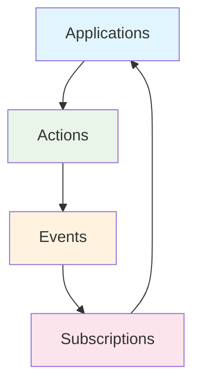
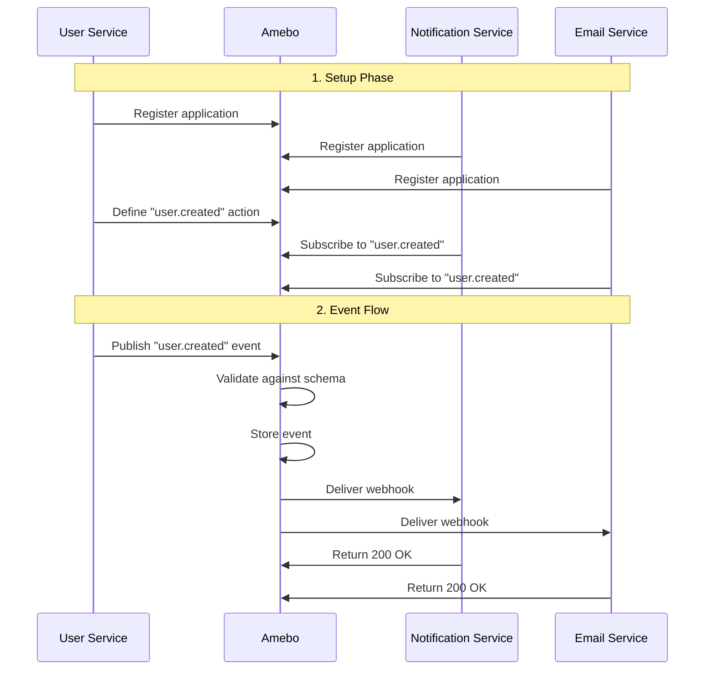

# Core Concepts

Amebo is built around four simple but powerful concepts that enable event-driven communication between applications. Understanding these concepts is key to effectively using Amebo.

## The Four Pillars



## 1. Applications

**Applications** are the microservices, modules, or system components that participate in event communication.

=== "Definition"

    An application represents any system that can:
    
    - **Publish events** (event producers)
    - **Receive events** (event consumers)
    - **Both** (most common scenario)

=== "Properties"

    | Property | Description | Example |
    |----------|-------------|---------|
    | **Name** | Unique identifier | `user-service` |
    | **Address** | Base URL or hostname | `https://api.example.com` |
    | **Secret** | Webhook authentication key | `webhook-secret-key` |

=== "Examples"

    ```json
    {
      "application": "user-service",
      "address": "https://users.myapp.com",
      "secret": "user-webhook-secret"
    }
    ```

### Application Lifecycle

1. **Registration**: Register with Amebo before publishing events
2. **Authentication**: Receive JWT token for API access
3. **Event Publishing**: Create events when business logic executes
4. **Event Consumption**: Receive webhooks for subscribed events

## 2. Actions

**Actions** define the types of events that can occur, along with their data structure (schema).

=== "Definition"

    An action is:
    
    - **Event type definition** with a unique name
    - **JSON Schema** for payload validation
    - **Owned by an application** that defines it

=== "Properties"

    | Property | Description | Example |
    |----------|-------------|---------|
    | **Name** | Unique action identifier | `user.created` |
    | **Application** | Owner application | `user-service` |
    | **Schema** | JSON Schema for validation | `{"type": "object", ...}` |

=== "Schema Example"

    ```json
    {
      "action": "user.created",
      "application": "user-service",
      "schemata": {
        "type": "object",
        "properties": {
          "id": {"type": "string"},
          "email": {"type": "string", "format": "email"},
          "name": {"type": "string"},
          "created_at": {"type": "string", "format": "date-time"}
        },
        "required": ["id", "email", "name"],
        "additionalProperties": false
      }
    }
    ```

### Action Naming Conventions

Use descriptive, hierarchical names:

- **Format**: `entity.verb` or `domain.entity.verb`
- **Examples**: 
  - `user.created`, `user.updated`, `user.deleted`
  - `order.placed`, `order.shipped`, `order.cancelled`
  - `payment.processed`, `payment.failed`, `payment.refunded`

## 3. Events

**Events** are actual occurrences of actions - the data payloads representing something that happened.

=== "Definition"

    An event is:
    
    - **Instance of an action** with actual data
    - **Immutable record** of what happened
    - **Validated** against the action's schema

=== "Properties"

    | Property | Description | Example |
    |----------|-------------|---------|
    | **Action** | Reference to action type | `user.created` |
    | **Payload** | Event data | `{"id": "123", "email": "john@example.com"}` |
    | **Timestamp** | When event occurred | `2024-12-10T10:30:00Z` |

=== "Event Example"

    ```json
    {
      "action": "user.created",
      "payload": {
        "id": "user-123",
        "email": "john.doe@example.com",
        "name": "John Doe",
        "created_at": "2024-12-10T10:30:00Z"
      }
    }
    ```

### Event Lifecycle

1. **Creation**: Application publishes event to Amebo
2. **Validation**: Payload validated against action schema
3. **Storage**: Event stored in database
4. **Distribution**: Event sent to all subscribers
5. **Delivery**: Webhooks delivered with retry logic

## 4. Subscriptions

**Subscriptions** define which applications want to receive which events and where to send them.

=== "Definition"

    A subscription is:
    
    - **Registration** to receive specific events
    - **Webhook endpoint** for event delivery
    - **Delivery configuration** (retries, timeouts)

=== "Properties"

    | Property | Description | Example |
    |----------|-------------|---------|
    | **Application** | Subscribing application | `notification-service` |
    | **Action** | Event type to receive | `user.created` |
    | **Handler** | Webhook URL | `https://api.example.com/webhooks/user-created` |
    | **Max Retries** | Retry attempts | `3` |

=== "Subscription Example"

    ```json
    {
      "application": "notification-service",
      "subscription": "user-created-notifications",
      "action": "user.created",
      "handler": "https://notifications.example.com/webhooks/user-created",
      "max_retries": 3
    }
    ```

## Event Flow Example

Let's trace a complete event flow through all four concepts:



### Step-by-Step Breakdown

=== "1. Application Registration"

    ```bash
    # User Service registers
    curl -X POST /v1/applications -d '{
      "application": "user-service",
      "address": "https://users.example.com",
      "secret": "user-secret"
    }'
    
    # Notification Service registers
    curl -X POST /v1/applications -d '{
      "application": "notification-service", 
      "address": "https://notifications.example.com",
      "secret": "notification-secret"
    }'
    ```

=== "2. Action Definition"

    ```bash
    # User Service defines user.created action
    curl -X POST /v1/actions -d '{
      "action": "user.created",
      "application": "user-service",
      "schemata": {
        "type": "object",
        "properties": {
          "id": {"type": "string"},
          "email": {"type": "string", "format": "email"},
          "name": {"type": "string"}
        },
        "required": ["id", "email", "name"]
      }
    }'
    ```

=== "3. Subscription Setup"

    ```bash
    # Notification Service subscribes
    curl -X POST /v1/subscriptions -d '{
      "application": "notification-service",
      "subscription": "user-notifications",
      "action": "user.created",
      "handler": "https://notifications.example.com/webhooks/user-created",
      "max_retries": 3
    }'
    ```

=== "4. Event Publishing"

    ```bash
    # User Service publishes event
    curl -X POST /v1/events -d '{
      "action": "user.created",
      "payload": {
        "id": "user-123",
        "email": "john@example.com", 
        "name": "John Doe"
      }
    }'
    ```

## Design Principles

Amebo's design follows these key principles:

=== "🎯 Simplicity"

    - **Only 4 concepts** to learn
    - **HTTP-first** API design
    - **JSON** for all data exchange
    - **RESTful** conventions

=== "🔒 Reliability"

    - **Schema validation** prevents bad data
    - **Automatic retries** handle failures
    - **ACID transactions** ensure consistency
    - **Dead letter queues** for failed events

=== "⚡ Performance"

    - **Asynchronous processing** for high throughput
    - **Batch processing** for efficiency
    - **Connection pooling** for database access
    - **Configurable batching** for optimization

=== "🌐 Flexibility"

    - **Multiple backends** (PostgreSQL, SQLite)
    - **Pluggable engines** (Kafka, RabbitMQ, etc.)
    - **Webhook delivery** to any HTTP endpoint
    - **Custom retry policies** per subscription

## Common Patterns

### 1. Event Sourcing

Store all state changes as events:

```json
{
  "action": "user.email_changed",
  "payload": {
    "user_id": "123",
    "old_email": "old@example.com",
    "new_email": "new@example.com",
    "changed_by": "user-123",
    "reason": "user_request"
  }
}
```

### 2. Saga Pattern

Coordinate distributed transactions:

```json
{
  "action": "order.payment_failed",
  "payload": {
    "order_id": "order-456",
    "payment_id": "pay-789",
    "error": "insufficient_funds",
    "next_action": "cancel_order"
  }
}
```

### 3. CQRS Integration

Separate command and query models:

```json
{
  "action": "product.inventory_updated",
  "payload": {
    "product_id": "prod-123",
    "old_quantity": 10,
    "new_quantity": 8,
    "operation": "sale",
    "order_id": "order-456"
  }
}
```

## Best Practices

1. **Action Naming**: Use clear, consistent naming conventions
2. **Schema Design**: Keep schemas simple but complete
3. **Event Granularity**: One event per business operation
4. **Idempotency**: Design events to be safely reprocessed
5. **Versioning**: Plan for schema evolution from the start

## Next Steps

- **[Applications Guide](applications.md)** - Deep dive into application management
- **[Events & Actions](events-actions.md)** - Learn about event publishing and schemas
- **[Subscriptions](subscriptions.md)** - Master event consumption patterns
- **[API Reference](../api/overview.md)** - Complete API documentation
